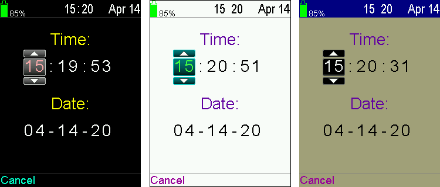
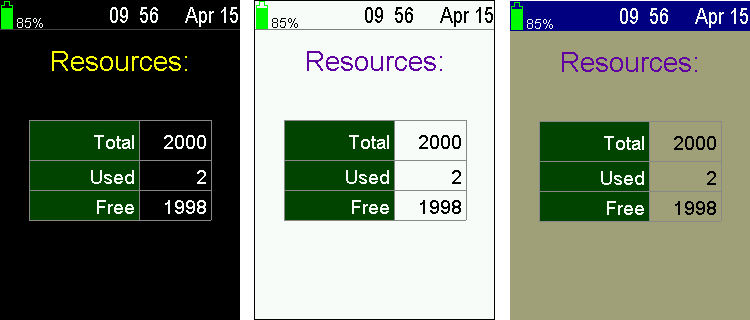
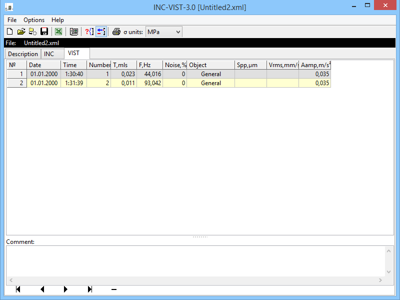

# inc-vist

## Used tools

IAR-7.60.2 
STM32CubeMX-4.25.1 
Code::Blocks-20.03 with MinGW-5.1.0 
Jython-2.7.2 with jdk-1.8.0_221 
Lazarus-2.0.6 
Inno Setup-6.0.4 
RealWorld Paint-2013.1 

### The "Start" screen

### The "Main menu" screen

### The "INC parameters" screen

### The "Measure mode" screen

### The "Enter password" screen (Password: "Arrow Up", "Arrow Down", "F")

### The "Engineering submenu" screen

### The "Initial device settings" screen

### The "Device type" screen

### The "Calibration" screen

### The "Reference supply source" screen

### The "Zero calibration" screen

### The "Measuring tract" screen

### The "DAC,LPF test" screen

### The "About device" screen

### The "Developer submenu" screen

### The "Flash dump" screen

### The "Service submenu" screen

### The "Date,time" screen

### The "Power savings" screen

### The "Supply source" screen

### The "Language" screen

### The "Theme" screen

### The "Keyboard sound" screen

### The "About device" screen

### The "Verification" screen

### The "Memory submenu" screen

### The "INC archive" screen

### The "VIST archive" screen

### The "Resources" screen

### The "Clear memory" screen

### The "INC measure" screen

### The "VIST measure" screen

### The desktop application to get device screenshots

### The desktop application to handle (read, save, export, print and etc) results of measures

